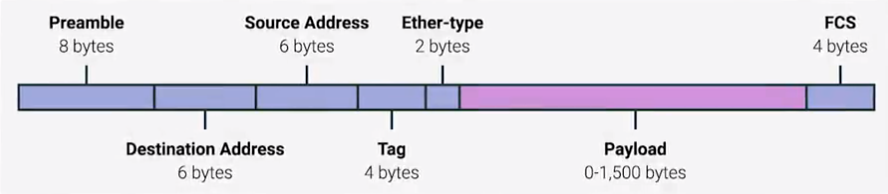

# Introduction to Networking (Week 1)

## Introduction to Computer Networking

* __Protocol:__ a defined set of standards that computers must follow in order to communicate properly.
* __Computer networking:__ the name we've given to the full scope of how computers communicate with each other.
* This course deals mainly with the _TCP/IP model_, though briefly discusses the OSI model.

## The TCP/IP Five-Layer Network Model

### Contents of the TCP/IP Five-Layer Model

||Layer Name|Protocols|Protocol Data Unit|Addressing|Analogy|
|-|---------|---------|------------------|----------|-------|
|5|Application|HTTP,SMTP,etc...|Messages|n/a|Contents of the Package|
|4|Transport|TCP/UDP|Segment|Port Numbers|Instructions for "knocking on door"|
|3|Network|IP|Datagram|IP Address|Identifies the route|
|2|Data Link|Ethernet, Wi-Fi|Frames|MAC Address|Intersections for Delivery Trucks|
|1|Physical|10 Base T, 802.11|Bits|n/a|Delivery Truck & Roads|

* The __Physical Layer__ represents the physical devices that interconnect computers.
    * Think cables, connectors, and sending signals
* The __Data Link Layer__ is responsible for defining a common way of interpreting these signals so network devices can communicate.
    * Sometimes called "Network Interface" or "Network Access Layer"
    * Here, the first protocols are introduced. (Like Ethernet)
    * __Ethernet__ standards define a protocol responsible for getting data to nodes on the same network or link.
* The __Network Layer__ allows different networks to communicate with each other through devices called "routers"
    * Sometimes called the "internet layer"
    * An __"internetwork"__ is a collection of networks connected together through routers, the most famous of these bein the __Internet__.
    * "Internet Protocol" or "IP" is the most common protocol used at the network layer; it is the "heart" of the Internet and most smaller (inter)networks around the world.
    * Network software usually follow a "client" and "server" model.
    * Client application initiates a request for data, and server applications respond with it.
* It's possible for web browsers and email clients to run at the same instance; likewise, it is possible for web and mail services to run on the same server.
* The __Transport Layer__ sorts out which client and server programs are supposed to get that data.
    * __Transmission Control Protocol (TCP)__ and __User Datagram Protocol (UDP)__ are two examples.
    * The major difference between TCP and UDP is that TCP allows for reliable data transferring while UDP does not.
* The __Application Layer__ are application specific (like those that allow for browsing the web or sending and receiving emails)

### The OSI Model \(after [Wikipedia](https://en.wikipedia.org/wiki/OSI_model)\)

|||Layer|Protocol Data Unit|Function|
|-|-|---|------------------|--------|
|7|Host Layer|Application|Data|High-level APIs, including resource sharing, remote file access|
|6|Host Layer|Presentation|Data|Translation of data between a networking service and an application; including character encoding, data compression and encryption/decryption|
|5|Host Layer|Session|Data|Managing communication sessions, i.e. continuous exchange of information in the form of multiple back-and-forth transmissions between two nodes|
|4|Host Layer|Transport|Segment, Diagram|Reliable transmission of data segments between points on a network, including segmentation, acknowledgement and multiplexing|
|3|Media Layer|Network|Packet|Structuring and managing a multi-node network, including addressing, routing and traffic control|
|2|Media Layer|Data link|Frame|Reliable transmission of data frames between two nodes connected by a physical layer|
|1|Media Layer|Physical|Symbol|Transmission and reception of raw bit streams over a physical medium|

## The Basics of Networking Devices

### Cables

* __Cables__ are what connect different devices to each other, allowing data to be transmitted over them
    * Cables can be split into two categories: copper and fibre
    * __Copper__ cables are the most common kind of networking cables, they are made up of multiple pairs of copper wires inside plastic insulators. Copper wires send data by changing the voltage between two ranges. The "recieving end" can then recieve these voltages and interpret them as 0's and 1's which can be translate into different kinds of data.
        * The most common forms of copper twisted-pair cables used in networking are __Cat5__ (older), __Cat5e__ and __Cat6__ cables. "Cat" is a shorthand for "category". Different categories have different physical characteristics.
        * How the copper wire is twisted can make a huge difference in the transmission rate of data, and how resistant they are to outside interference.
    * __Crosstalk__ is what happens when an electric pulse on one wire is accidentally detected on another wire.
        * As a result, the "recieving end" is unable to recieve the data, resulting in error.
    * Cat5e cables are made in a way that makes it less likely that data needs to be retransmitted. More data can be transferred in a small amount of time.
    * Cat6 cables are even more strict in their specifications to avoid crosstalk. Cat6 cables can transmit more data at a faster rate than Cat53, but are shorter as a trade-off for speed and reliability.
    * __Fibre optic cables__ are the second category of cables, which contain individual optical fibres, which are tiny tubes made out of glass, with the width the size of a human hair. They transport beams of light, using pulses of light to represent 0's and 1's, and can even resist electromagnetic interference. The only drawback is that they're more fragile and expensive.
        * As an added bonus, fibre wires can transfer data at longer distances than copper!    

* You are more likely to run into fibre wires in a data centre, and run into copper wires at small homes.

### Hubs and Switches

* A __collision domain__ is a network segment where only one device can communicate at a time; if multiple systems try sending data at the same time, the electrical pulses sent across the cable can intefere with each other.

* Point-to-point network connects can be useful in some settings, but we need to connect multiple computers at the same instance. That's where hubs and switches comes in.
    * A __hub__ is a physical layer device that allows for connections from many computers at once. Hubs are rare because they rely on a collision domain, which is undesirable.
    * A __network switch__ is similar to a hub, but rather than operating on the "physical", "layer 1" part of the network, it operates on the "data link", "layer 2" part of the network, meaning that it can inspect the contents of the Ethernet protocol data, and work out where data should be sent to. This almost eliminates collision domains.
    
* Hubs and switches are the primary devices used to connect computers on a single network, usually refered to a __LAN__ or __local area network__.

### Routers

* A __router__ is a device that knows how to forward data between independent networks
    * Routers operate on layer 3, the "network" part of the TCP/IP Five-Layer Model.
    * Routers inspect IP data to determine where to send content.
* ISP = Internet Service Provider
* The __Border Gateway Protocol__ is what allows routers to share data with each other. It lets them learn about the most optimal paths to forward traffic.

### Servers and Clients

* __Nodes__ refer to the devices on the network (laptop, desktop smartphone, IOT device, etc.)
* A __client__ is something that requests data whilst a __server__ is something that responds with data.
* Nodes can act as both clients and servers at some capacity
    * i.e. an node that's primary purpose is to act as an email server may occationally make DNS requests or a desktop server can occationally respond with data.

## The Physical Layer

* The __bit__ is the smallest unit of data that a computer can understand; it's a one (1) or a zero (0)
* __Modulation__ is a way of varying the voltage of this charge moving across the table
* __Line coding__ allows devices on either end of the link to understand that an electrical charge is at a 0 or 1. About 10 billion bits can be moved around every second!

* A __twisted pair cable__ features pairs of copper wires that are twisted together.
    * Twisted pair protects from electromagnetic interference and crosstalk.
    * The Twisted Pair Cable uses line coding as its type of modulatuion

* A standard Cat6 cable consists of eight (8) wires consisting of four (4) twisted pairs inside a single jacket.
* These kind of cables typically allow for duplex communication.
* __Duplex Communication__ is the notion that information can flow in both directions across the cable. 
     * __Full Duplex__ is the notion that both nodes can communicate with one another at the same time.
     * __Half Duplex__ is the notion that both nodes can communicatw with one another whilst "taking turns"
* __Simplex Communication__ is the notion that information flow is unidirectional.

* __Network Ports__ are the mechanisms that expose the information being transmitted on the wire to different interfaces; they are generally directly attached to the devices that make up a computer network.
    * A common __plug__ specification is the RJ45 plug and it's respective RJ45 __port__
    
* Network ports typically have two LEDs, the Link LED and the Activity LED.
    * The __Link LED__ is lit when a compatible network plug is connected to the network port.
    * The __Activity LED__ is lit when information is being transmitted across the cable.
    
* A __patch panel__ is a device containing many network ports, but does no other work

## The Data Link Layer

### Ethernet and MAC Address

* __Ethernet__ is a standard that allows network hardware to be "abstracted" and "standardized" so that one need not worry about the different kinds of network hardware.
    * Example: your web browser doesn't need to know if your device is working with a twisted-pair or wireless connection, it just needs a standard like Ethernet to do the work. 
* Ethernet (along with __Wi-Fi__) operates within layer 2 of the TCP/IP model, the "data link" layer.
* __Carrier-sense multiple access with collision detection (CSMA/CD)__ is used to determine when the communication channels are clear, and when a device is free to transmit data.
* __Hexidecimal__ is a numbering system that uses sixteen (16) digits to represent numbers. They employ the letters A, B, C, D, E, and F to do this. For the hexidecimal number system, consult the table below:

|__Decimal__|1|2|3|4|5|6|7|8|9|10|11|12|13|14|15|
|-----------|-|-|-|-|-|-|-|-|-|--|--|--|--|--|--|
|__Hexadecimal__|1|2|3|4|5|6|7|8|9|A|B|C|D|E|F|

* A __MAC Address__ is a globally unique identifier attached to an individual network interface; it's a 48-bit number normally represented by six groupings of two hexadecimal numbers.

* An __octet__ is any number that can be represented in eight (8) bits, this is commonly used in computer networking.
* A MAC address is typically split into two (2) sections:
    * The first three (3) octets are the __organizationally unique identifier (OUI)__, which are assigned to individual hardware manufacturers by the IEEE
    * The second three (3) octers are vendor assigned. They can be assigned any number possible, with the exception that the number assigned is unique and can be only assigned once.
    
    ||Organizationally Unique Identifier|Vendor Assigned (NIC Cards, Interfaces)|
    |----------------------|-----------------------|----------------------------|
    |Size (in bits)|24 bits|24 bits|
    |Size (in hex)|6 hex digits|6 hex digits|
    |Example|00 60 2F|3A 07 BC|
    |Structure|Cisco|Particular Device|
    
* Ethernet uses MAC addresses to ensure that the data it sends has both an address for the machine that sent the transmission, as well as the one the transmission was intended for

### Unicast, Multicast and Broadcast

* A __unicast__ transmission is always meant for just one receiving address
    * If the least significant bit in the first octet of a destination address is set to zero, it means that the ethernet frame is intended for only the destination address.
    
* If the least significant bit in the first octet of a destination address is set to one, it means that you're dealing with a __multicast frame__. This means that the data will be broadcasted to the devices on the local network segment, and devices may discard it depending on its configuration other than MAC address

* Finally, a __broadcast__ is where data is sent to every single device on the local area network. This is accomplished by sending data to the broadcast address (FF:FF:FF:FF:FF:FF in Ethernet). Broadcasts are used so that nodes and devices can discover one another. 

### Disecting the Ethernet Frame

* A __data packet__ is an all-encompasing term that represents any single set of binary data being sent across a network link.
* Data packets at the Ethernet level are known as Ethernet Frames
* An __Ethernet frame__ is a highly structured collection of information presented in a specific order

* A __preamble__ is eight (8) bytes (or 64 bits) long, and can itself be split into two sections
* The __Start frame delimiter (SFD)__ signals to a reciving device that the preamble is over and that the actual frame contents will not follow.
* The __EtherType field__ is 16 bits long and used to describe the protocol of the contents of the frame
* The __VLAN header__ indicates that the frame itself is what's called a VLAN frame
* __Virtual LAN (VLAN)__ is a technique that lets you have multiple logical networks operating on the same physical equiptment.
* A __payload__ in networking terms, is the actual data being transported, which is everything that isn't the header or footer
* The __Frame Check Sequence__, the footer, a four (4) byte (32 bit) number that represents the checksum value for the entire frame, such a checksum is calculated by performing what's known as a cyclical redundancy check against the frame
* __Cyclical Redundancy Check (CRC)__ is an important concept for data integrity and is used all over computing, not just network transmissions---this is a mathematical transformation that uses polynomial divison to create a number that represents a larger set of data.
