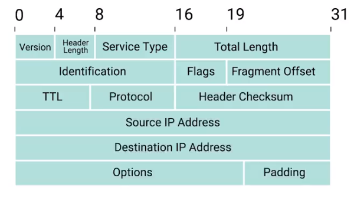
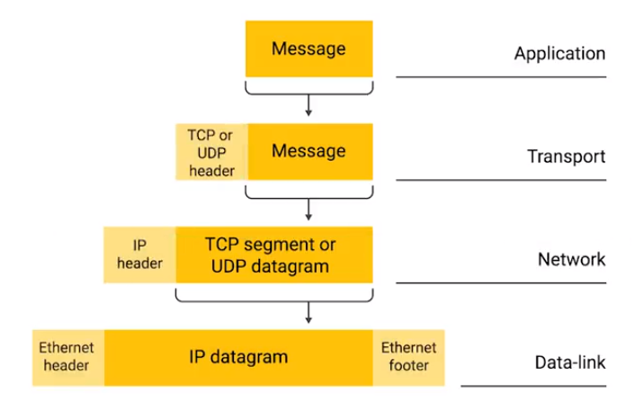

# The Network Layer (Week 2)

## The Network Layer

* Remember, on a local area network (LAN), computers communicate with one another through their MAC addresses, which is great for small scale networks.
* MAC addresses, however, don't scale well; every device on the planet has a MAC address, and there is no way to fully know where a particular device is on the planet given just its MAC address.
* The Network Layer is the solution to the problem involving internetwork transmissions.

### IP Addresses

* __IP Addresses__ are a 32-bit number made up of four octets, with each of these octets usually being described in decimal number. An example

|IP Address (Decimal): |172|16|254|1|
|-|-|-|-|-|
|IP Address (Octet): |10101100|00010000|11111110|00000001|

* Each octet must correspond to a number between 0 and 255. This means that 12.34.56.78 would be a valid IP address, but 123.456.789.100 is not a valid IP address because "456" and "789" are larger than what can be represented by the 8 bit octet.
* The decimal format (i.e. 192.168.0.1) is known as __dotted decimal notation__.
* IP Addresses are distributed by large "de facto" organizations, as opposed by being determined by hardware vendors.
    * As a result, IP addresses are better for sending and recieving data over an (or the) internet.
* IP addresses belong to networks, not to the devices attached to those networks.
    * You laptop will always have the same MAC address, but a different IP address when you sign on to different networks.
    * The LAN is responsible for assigning IP addresses to devices
    
* Through a protocol called __Dynamic Host Configuration Protocol__, a dynamic IP address is assigned to the host.
* It's also possible to manually assign a __static IP address__.
* In most cases static IP addresses are reserved for servers and network devices, while dynamic IP addresses are reserved for clients.    

### IP Datagrams and Encapsulation

* An __IP datagram__ is a highly structured series of fields that are strictly defined, like an Ethernet frame

* The __Version__ field is the version of IP addressing that is in use
    * At the moment, the most common version of __IP addressing__ is __IP version 4__ or __IPv4__...
    * ... and __IP version 6__, or __IPv6__ is a new scheme that is quickly gaining momentum.
* __Header Length__ just says how long the entire header is, it is almost 20 bytes in length when dealing with IPv4
* The __Service Type__ field is eight bits long and is used to specify the Quality of Service or QoS technologies
    * __Quality of Service__ tries to tell the router which IP datagrams are more important
* The __Total Length Field__ is a 16-bit field that indicates the total length of the IP datagram that it's attached to
* The __Identification field__ is a 16-bit number that is used to group messages together
    * The maximum size of a single datagram is the largest number that you can represent with 16 bits: 65,535
    * If the total amount of data that needs to be sent is larger than what can fit in a single datagram, the IP layer needs to split this data 
* The __flag field__ is used to indicate if a datagram is allowed to be fragmented, or to indicate that the datagram has already been fragmented
* __Fragmentation__ is the process of taking a single IP datagram and splitting it up into several smaller datagrams
* __Time to Live (TTL)__ is an 8-bit field that indicates how many router hops a datagram can traverse before it's thrown away
    * Every time a datagram reaches a new router, the TTL gets decremented by one (1)
    * Once the value reaches zero (0), the router knows it doesnt have to forward the datagram any further.
    * The point of TTL is to make sure that datagrams don't "an eternity" to reach their destination in case of a network failure
    * An "endless loop" situation is where router A thinks router B is the next hop, and router B thinks router A is the next hop
* The __Protocol__ field is another 8-bit field that contains data about what transport layer protocol is being used
    * With TCP and UDP being the most commonly used
* The __header checksum__ field is a checksum of the contents of the entire IP datagram header
    * because TTL has to be recomputed everytime it reaches a router, the header checksum is in effect, recomputed.
* The __source__ and __destination__ fields hold the source and destination IP addresses respectively
* The __IP options field__ is an optional field that is used to set special characteristics for datagrams primarily used for testing purposes.
* The __padding field__ is a series or zeroes used to ensure the header is the correct total size

All of this is done through the process of encapsulation, which can be seen below:

### IP Address Classes

* IP addresses can be split into two sections: the network ID and the host ID
* Given an IP address _192.168.0.1_, the "network" part of the IP address would be the left half and the host part of the IP address would be the right half
* The __Address class system__ is a way of defining how the global IP address space is split up
* There are three primary types of IP classes
    * __Class A__ IP classes are those where the first octet is used with a network ID and the last three are used for the host ID
        * If the first bit of an IP address is a zero, it's class A
    * __Class B__ IP classes are where the first two octets are the network ID and the last two are the host ID
        * If the first two bits are 1 and 0, then it's class B
    * __Class C__ IP classes are IP addresses where the first three octets are associated with the network ID and the last octet is associated with the host ID
        * If the first three bits are 1, 1 and 0, then it's class C

* Each address class represents a network range of different maximum hosts

|Class|Range|Max Hosts|
|-----|-----|---------|
|A|0-126|16,777,216|
|B|128-191|65,536|
|C|192-224|254|
|D|224-239|N/A|
|E|240-255|N/A|

* __Classless Inter-domain Routing (CIDR)__ is what is replacing the class system

### Address Resolution Protocol

* __Address Resolution Protocol (ARP)__ is a protocol used to discover the hardware address of a node with a certain IP address
* An __ARP table__ is a list of IP addresses and the MAC addresses associated with them
    * The transmitting device might also store the MAC address in it's own local ARP table

* ARP table entries generally expire after a short amount of time to ensure changes in the network are accounted for

## Subnetting

* __Subnetting__ is the process of taking a large network and splitting it up into many individual and smaller subnetworks, or subnets
* Incorrect subnetting setups are a common problem you might run into as an IT support specialist, so it's important to have a strong understanding of how it works.

### Subnet Masks

* With subnets, part of the host ID of an IP address would be used to form a subnet ID.
* At the internet level, core routers only care about the network ID and use it to send the datagram to appropriate networks.
* Subnet IDs give the datagram additional information to send the datagram to the destination machine, or the next router in the network.

* The host ID finally provides the last bit of information for the last router on where to deliever the datagram
* A __subnet mask__ is a 32-bit number that is normally written out as four octers in decimal
* Subnet ID's are calculated via a subnet mask

* For example: given an IP address of *9.100.100.100*, 

|IP Address|9|100|100|100|
|----------|-|---|---|---|
|In Binary |0000 1001|0110 0100|0110 0100|0110 0100|
|Subnet Mask|255|255|255|0|
|Subnet Mask (in binary)|1111 1111|1111 1111|1111 1111|0000 0000|

* The subnet mask can be seen as a "special" IP address that tells us (in the forms of 1's) what we can ignore when calculating the host ID. The part with all the 0's tell us what to keep when computing the host ID.
* The subnet mask's purpose is to tell a router what is the subnet ID of the network in question
* A single 8-bit number can represent 256 different different numbers, or more specifially, the numbers 0-255.

### Basic Binary Math

* There are two basic operators in binary arithmetic, __OR__ and __AND__.
* In computer logic, a 1 represents true and a 0 represents false.

* A __subnet mask__ is a way for a computer to use and operators to determine if an IP address exists on the same network
* When applying an __AND__ operation with the example IP address of _9.100.100.100_ against the subnet mask of _255.255.255.0_, we get the network ID of the network in question

Example:

|IP Address|9|100|100|100|
|----------|-|---|---|---|
|__AND__|||||
|Subnet Mask (in binary)|1111 1111|1111 1111|1111 1111|0000 0000|
|__=__|||||
||9|100|100||

* The computer can now make a comparison using this result to determine if the network ID indicates that it's on the same network or if it's on a different network

### CIDR

__Subnet Masks and IP Address__

|Class|Mask Short Name|Max Hosts|
|-----|---------------|---------|
|A|255.0.0.0|/8|16,777,214|
|B|255.255.0.0|/16|65,534|
|C|255.255.255.0|/24|254|
| |255.255.255.224|/27|30|
| |255.255.255.252|/30|2|

* To __demarcate__ means to set something off
* The __demarcation point__ is how we describe where one network or system ends, and another one begins
* __Classless Inter-Domain Routing (CIDR)__ a flexible approach on describing blocks of IP Addresses. It expands on the notion of subnetting to demarcate networks.
    * __CIDR Notation__ is the /\[number\] notation
    * CIDR abandons the idea of classes entirely, allowing an address to be defined by two individual IDs 
    * CIDR allows for more arbitrary network sizes

## Routing

### Basic Routing Concepts

* A __router__ is a network device that forwards traffic depending on the destination address of that traffic

### Router Tables

* A __routing table__ 
* Fun fact: the first routers were the equivilent of desktop computers with their routing tables being manually updated.
    * It's also possible to build a DIY router today with a computer with two interfaces and a manually updated routing table
    
* Routing Tables have four columns:
    * The __destination network__, which contains a row for each network that the router knows about; aka the remote network (which again, consists of a network ID and a subnet mask). They can be stored in one column/row in CIDR notation
    * The __next hop__, which is the IP address of the next router to recieve data indended for the destination network in question. It can also just state that the network is already connected, and there aren't any additional hops to go through
    * The __total hops__, a crucial component to how routers and routing tables work. There are so many paths to get from a source point to a destination point. Routers like to take the shortest paths, but the shortest possible path can change over time for a variety of reasons
    * The __interface__, that the router should forward traffic matching the destination network out of
    
* It should be noted that core internet routers have millions of rows in their tables.

### Interior Gateway Protocols

* __Router Protocols__ are special protocols that routers use to share with each other what information that they may have
    * Routing protocols fall into two main categories: _interior gateway protocols_ and _exterior gateway protocols_
* An __Autonomous System__ is a collection of networks that all fall under the control of a single network operator
    * e.g. a large corporation that needs to forward data between their various networks, or a ISP that has national
* __Interior gateway protocols__ are used by routers to share information within a single autonomous system
    * they are further split into two categories: _link state routing protocols_ and _distance-vector protocols_

### Exterior Gateway Protocols

* The __Internet Assigned Numbers Authority (IANA)__ is a non-profit organization that helps manage things like IP address allocation
    * Along with managing IP address allocation, the __IANA__ is also responsible for the __ASN__ or the __Autonomous System Number__ allocation
* __Autonomous System Numbers (ASN)__ are numbers assigned to individual autonomous systems.

### Non-Routable Address Space

* The IP address, a single 32-bit number, can represent 4,294,967,295 unique numbers.
    * seems like a lot, but since we have 7.5 billion humans (as of 2017), there won't be enough IP Addresses for everyone; the IPv4 standard can't serve everyone
    
* RFC = __Request for Comments__ - a set of standards on how the internet would run
* __Non-Routable Address Space__ is a definition of IP address ranges that do not direct to other routers
* __Network Address Translation (NAT)__ allows for devices on non-routable address space to communicate with other devices over the internet.
* __RFC 1918__ defined three IP address ranges that will never be routed by core routers. 
    * Anyone can use these ranges!
    * They Are:
        * 10.0.0.0/8
        * 172.16.0.0/12
        * 192.168.0.0/16
